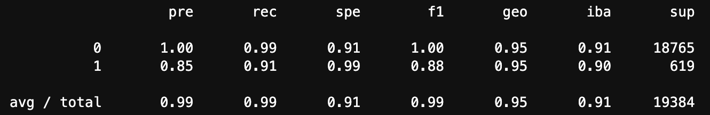
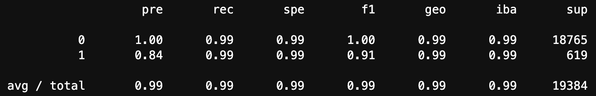

# **Credit Risk Analysis Report**

## **Overview of the Analysis**

The purpose of this analysis is to develop machine learning models that can predict the creditworthiness of borrowers based on historical lending data from a peer-to-peer lending services company. The dataset includes information on loan size, interest rate, borrower income, debt-to-income ratio, number of accounts, derogatory marks, and total debt. The target variable is the loan_status column, which indicates whether a loan is healthy (0) or has a high risk of defaulting (1).

---

## **The analysis consisted of the following stages:**

**1. Data Preparation:** The dataset was split into labels (loan_status) and features (other columns).

**2. Model Development with Original Data:** A logistic regression model was trained using the original data and evaluated for performance.

**3. Model Development with Resampled Data:** The original data was resampled using RandomOverSampler to address class imbalance, and a logistic regression model was trained using the resampled data and evaluated.

---

## **Results**

## **Logistic Regression Model with Original Data:**

**Balanced Accuracy Score:** 0.952

**Precision (0):** 1.00

**Precision (1):** 0.85

**Recall (0):** 0.99

**Recall (1):** 0.91

---

## **Logistic Regression Model with Resampled Data:**

**Balanced Accuracy Score:** 0.994

**Precision (0):** 1.00

**Precision (1):** 0.84

**Recall (0):** 0.99

**Recall (1):** 0.99

---

## **Summary**

Both machine learning models performed well in predicting credit risk, but the logistic regression model trained with resampled data demonstrated better performance. The resampled model achieved a higher balanced accuracy score of 0.994 compared to 0.952 for the original model. It also exhibited higher precision and recall for predicting both healthy loans (0) and high-risk loans (1).

The performance of the models depends on the problem we are trying to solve. In the context of credit risk analysis, it is crucial to have a balance between correctly identifying high-risk loans (1) and accurately classifying healthy loans (0). The logistic regression model trained with resampled data provides a more balanced and accurate prediction, making it the recommended model for credit risk analysis in this scenario.

The logistic regression model with resampled data improves the classification of high-risk loans, which is essential for risk assessment and decision-making in lending. By addressing class imbalance, the model provides a more reliable prediction of creditworthiness and helps mitigate potential losses from defaulting loans.

Therefore, based on the results and the goal of predicting creditworthiness, it is recommended to use the logistic regression model trained with resampled data for credit risk analysis in this dataset.